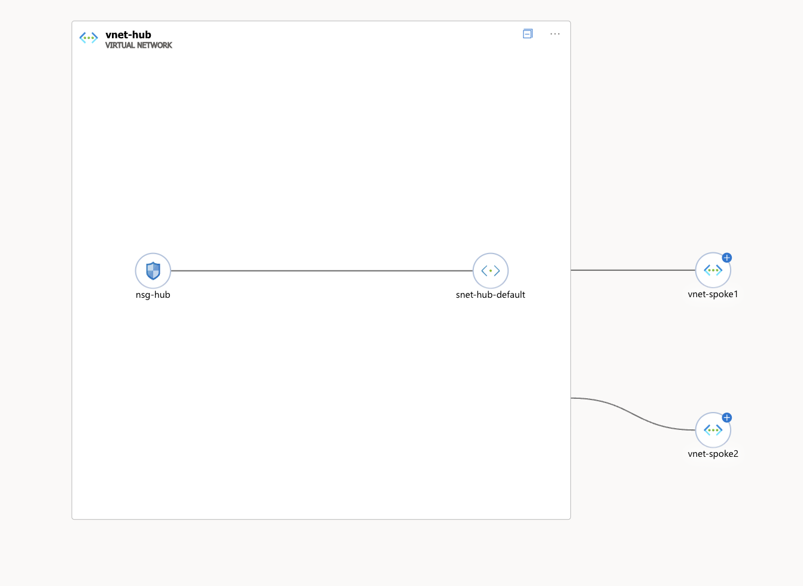

# Project 2 - Hub-Spoke Network Topology

## What this project does
Provisions an enterprise hub-spoke network architecture in Azure using Terraform.

## Architecture


## Resources created
- Hub VNet (10.0.0.0/16)
- Spoke1 VNet (10.1.0.0/16)
- Spoke2 VNet (10.2.0.0/16)
- VNet Peering (bidirectional - hub to each spoke)
- Network Security Group with SSH allow and deny-all rules

## AWS equivalent
- VNet = AWS VPC
- VNet Peering = Transit Gateway attachments
- NSG = Security Groups + NACLs

## How to deploy
```bash
terraform init
terraform plan
terraform apply
```

## Author
Tanupriya Dehariya
