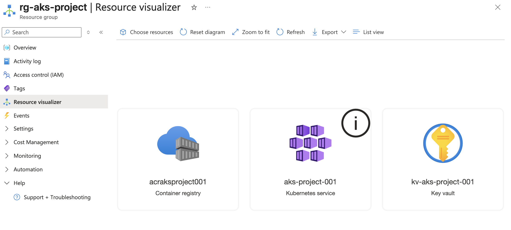

# Project 3 - AKS Cluster with ACR and Key Vault

## What this project does
Provisions a production-ready Kubernetes environment on Azure using Terraform.

## Architecture


## Resources created
- AKS Cluster (1 node, Standard_D2s_v3)
- Azure Container Registry (ACR) for Docker images
- Key Vault for secrets management
- Role Assignment allowing AKS to pull images from ACR

## AWS equivalent
- AKS = AWS EKS
- ACR = AWS ECR
- Key Vault = AWS Secrets Manager + KMS

## How to deploy
```bash
terraform init
terraform plan
terraform apply
```

## Author
Tanupriya Dehariya
