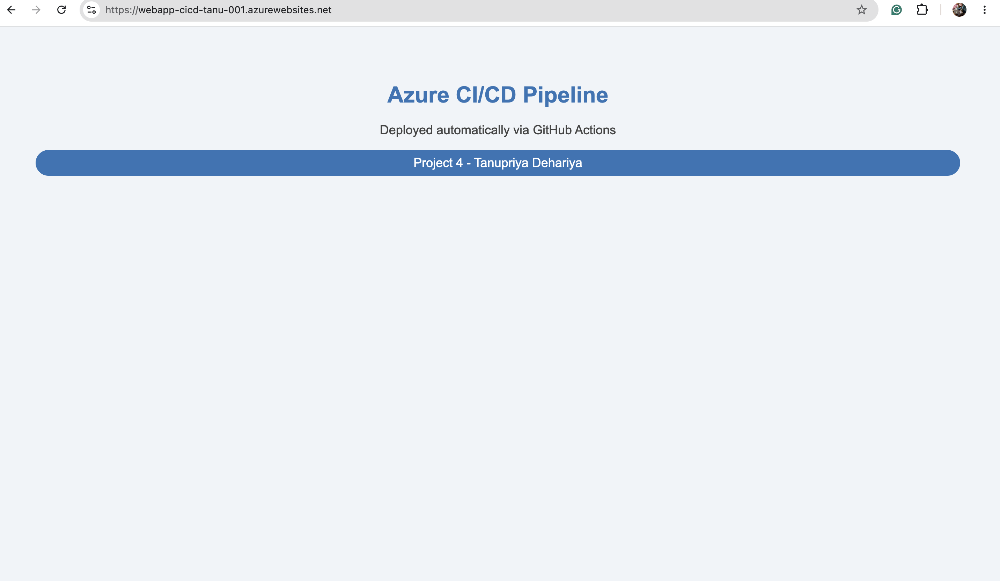
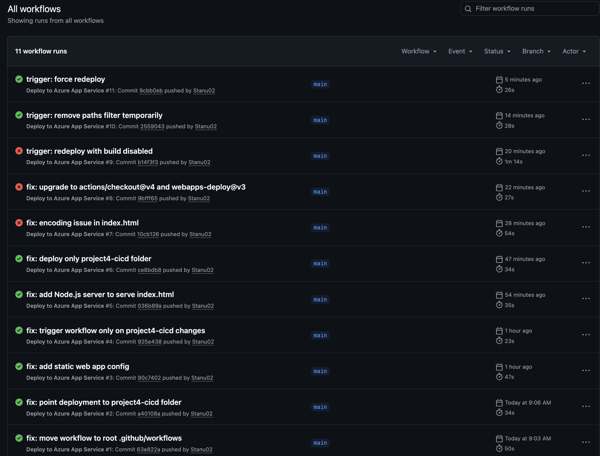

# Project 4 - GitHub Actions CI/CD Pipeline

## What this project does
Automatically deploys a web app to Azure App Service every time code is pushed to GitHub.

## Live URL
https://webapp-cicd-tanu-001.azurewebsites.net

## Architecture
Push code → GitHub Actions triggers → Deploys to Azure App Service → Live on internet

## Screenshots
### Live App


### GitHub Actions Workflow


## Resources created
- Azure Resource Group
- App Service Plan (Linux, B1)
- Linux Web App (Node.js 18)
- GitHub Actions workflow for automated deployment

## AWS equivalent
- App Service = AWS Elastic Beanstalk
- GitHub Actions = AWS CodePipeline + CodeBuild

## How to deploy
```bash
terraform init
terraform plan
terraform apply
```

## Author
Tanupriya Dehariya
