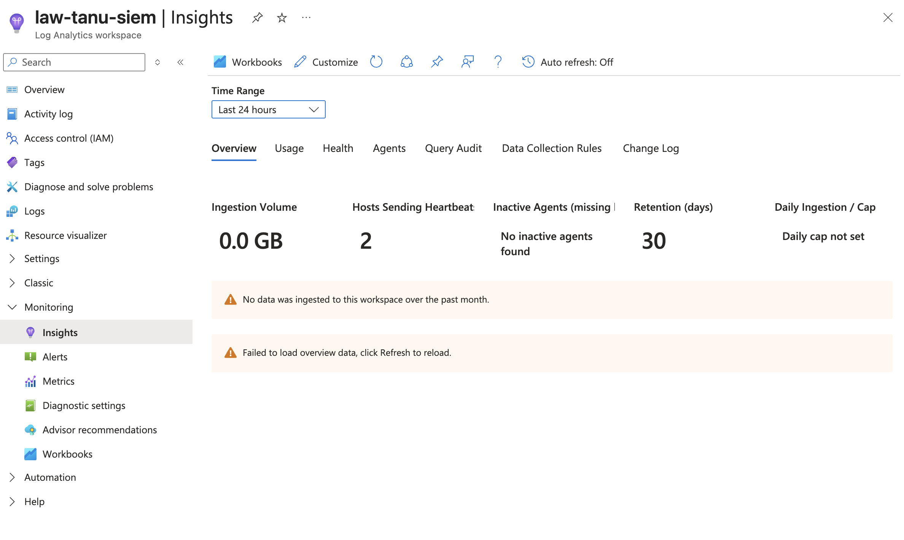
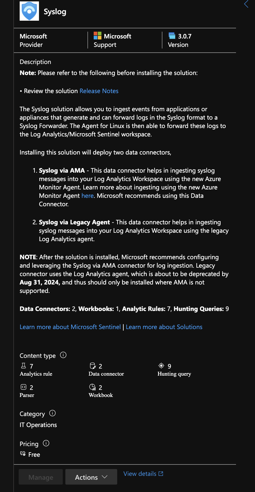
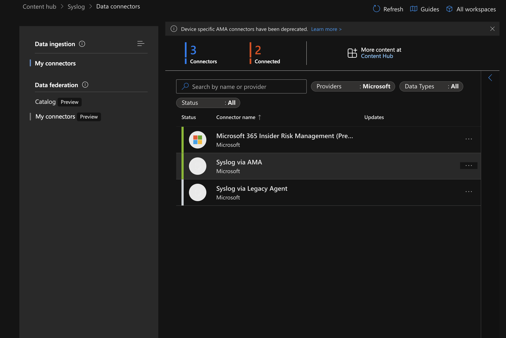
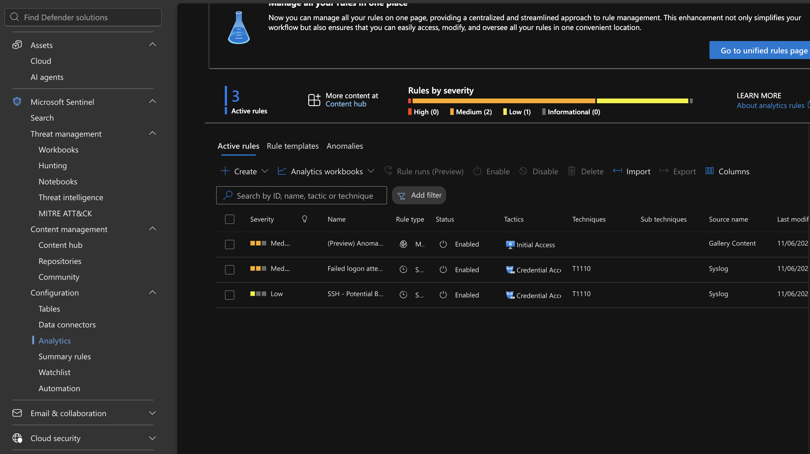
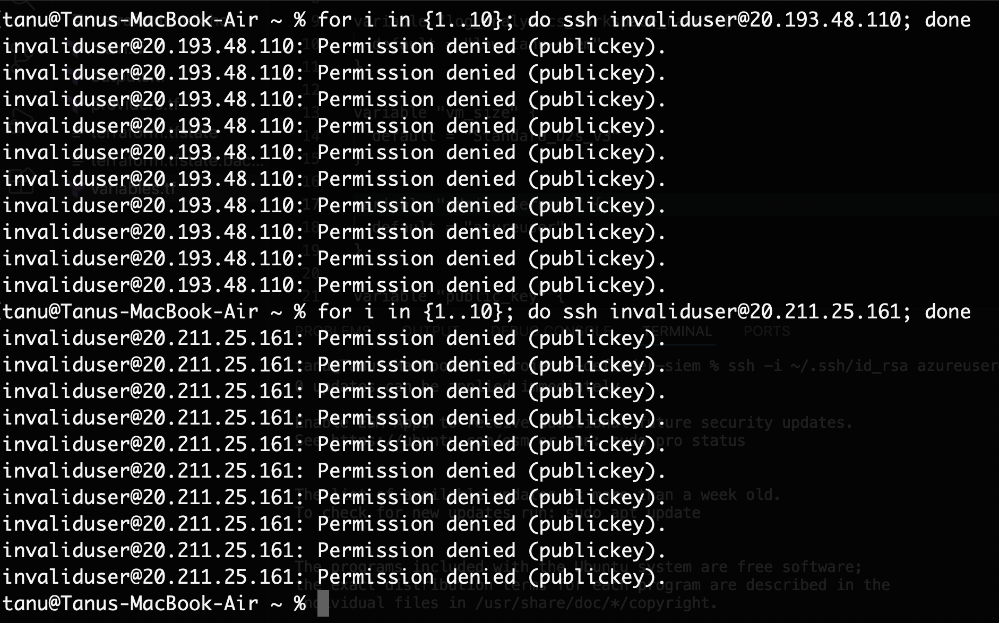
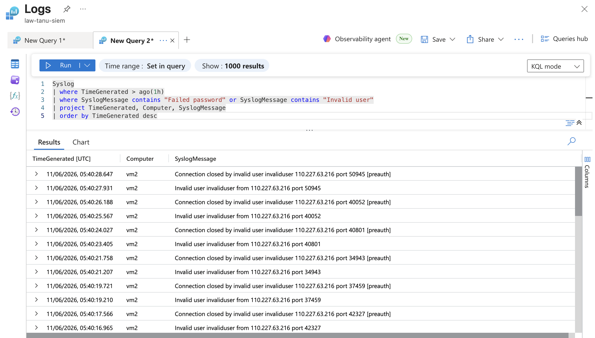
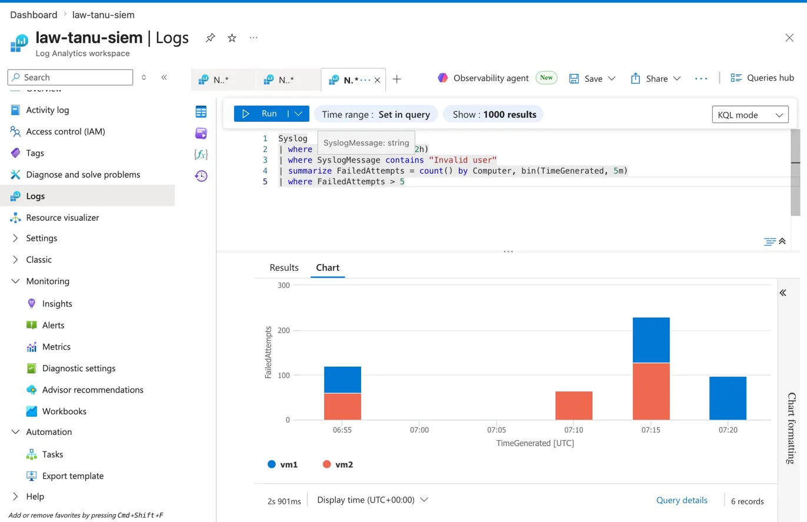
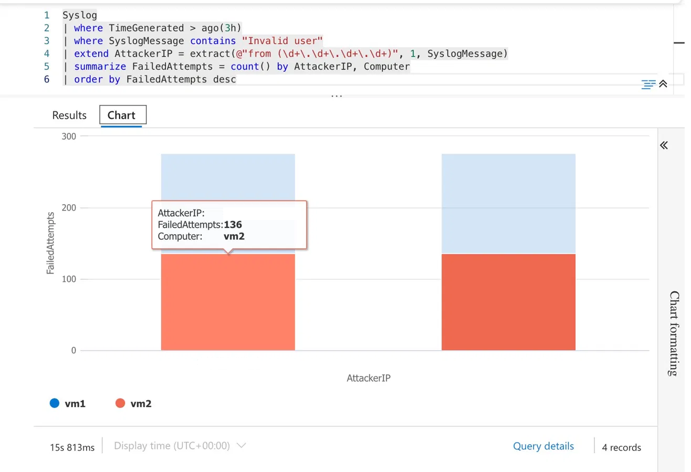
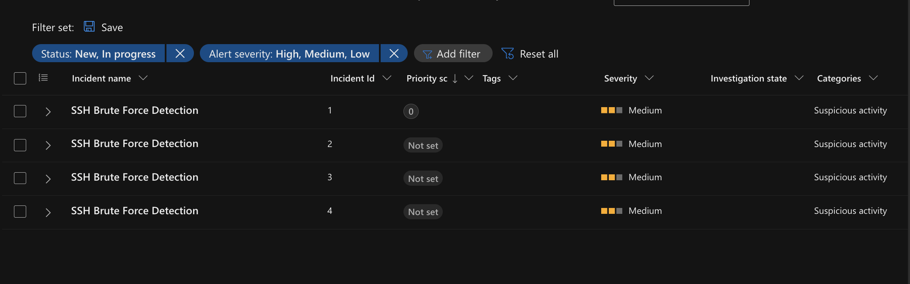
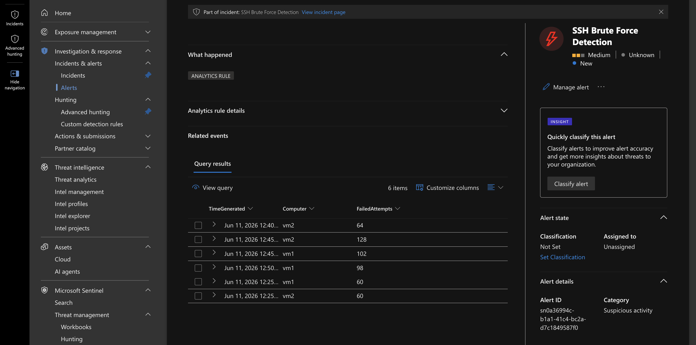

# Project 5 - Azure SIEM: Defender for Cloud + Microsoft Sentinel

## What this project does

Deploys two Linux VMs that send logs to a central Log Analytics Workspace. Microsoft Sentinel monitors those logs, detects suspicious activity, and raises incidents automatically. Includes a real attack simulation and KQL-based investigation.

## Architecture

```
Two Linux VMs (vm1, vm2)
        │
        ▼
Data Collection Rule (Syslog via Azure Monitor Agent)
        │
        ▼
Log Analytics Workspace (law-tanu-siem)
        │
        ▼
Microsoft Sentinel
        │
        ▼
Analytics Rule: SSH Brute Force Detection
        │
        ▼
Incidents → KQL Investigation
```

## Screenshots

### Log Analytics Workspace – Heartbeats from both VMs


### Syslog Solution installed from Content Hub


### Data Connector – Syslog via AMA connected


### Analytics Rules – 4 active rules


### Attack simulation – failed SSH attempts from terminal


### KQL – Failed SSH attempts appearing in logs


### KQL – Attack pattern across both VMs over time


### KQL – Attacker IP investigation (IP redacted)


### Sentinel Incidents – 4 SSH Brute Force incidents raised


### Alert detail – query results that triggered the incident


## Resources created

- Resource Group (rg-defender-siem)
- Log Analytics Workspace (law-tanu-siem, 30-day retention)
- Virtual Network + Subnet + NSG (SSH restricted to my IP only)
- 2x Ubuntu 22.04 VMs (Standard_D2s_v3)
- Data Collection Rule (Linux Syslog ingestion)
- Azure Monitor Agent (auto-installed on both VMs)
- Microsoft Sentinel
- Syslog solution from Content Hub (7 analytics rules, 2 connectors)
- Custom analytics rule: SSH Brute Force Detection
- 683 simulated brute-force attempts → 4 incidents generated

## AWS equivalent

| Azure | AWS |
|-------|-----|
| Log Analytics Workspace | CloudWatch Logs |
| Microsoft Sentinel | Security Hub + GuardDuty |
| Defender for Cloud | Inspector |
| Azure Monitor Agent | CloudWatch Agent |
| KQL | CloudWatch Logs Insights |

## Things that didn't go smoothly (and how I fixed them)

**VM size availability** – Australia East had capacity issues with B-series VMs. Tried `Standard_B1s`, `Standard_B2s`, and `Standard_B1ms` before `Standard_D2s_v3` worked. If you hit `SkuNotAvailable`, just try a different size.

**SSH timeout** – My home IP changed between sessions. NSG rule was still allowing the old IP. Fixed by running `curl -4 ifconfig.me`, grabbing the new IP, and updating `variables.tf`.

**Content Hub moved** – Sentinel's Content Hub now lives in the Microsoft Defender portal (`security.microsoft.com`), not the Azure portal. Follow the redirect.

**Built-in rules use the legacy agent** – The SSH brute-force templates reference the old Log Analytics agent. Since I'm using Azure Monitor Agent, I had to create a custom scheduled query rule pointing at the `Syslog` table directly.

**Incidents not showing** – The Incidents page has a "Priority score: 15-100" filter on by default. Custom rule incidents come in with no priority score, so they were hidden. Removed the filter and they appeared.

## KQL queries used

```kql
-- Find failed SSH attempts
Syslog
| where TimeGenerated > ago(1h)
| where SyslogMessage contains "Invalid user"
| project TimeGenerated, Computer, SyslogMessage
| order by TimeGenerated desc

-- Count failed attempts per VM in 5-minute windows
Syslog
| where TimeGenerated > ago(2h)
| where SyslogMessage contains "Invalid user"
| summarize FailedAttempts = count() by Computer, bin(TimeGenerated, 5m)
| where FailedAttempts > 5

-- Identify attacker source IP
Syslog
| where TimeGenerated > ago(3h)
| where SyslogMessage contains "Invalid user"
| extend AttackerIP = extract(@"from (\d+\.\d+\.\d+\.\d+)", 1, SyslogMessage)
| summarize FailedAttempts = count() by AttackerIP, Computer
| order by FailedAttempts desc
```

## How to deploy

```bash
terraform init
terraform plan
terraform apply
```

Update `variables.tf` with your SSH public key and current IP before running.

## Author

Tanupriya Dehariya
